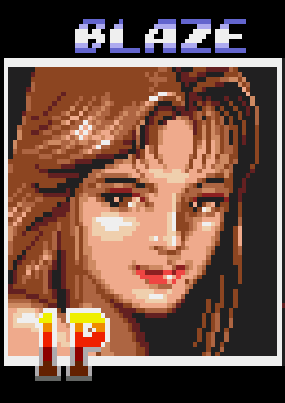
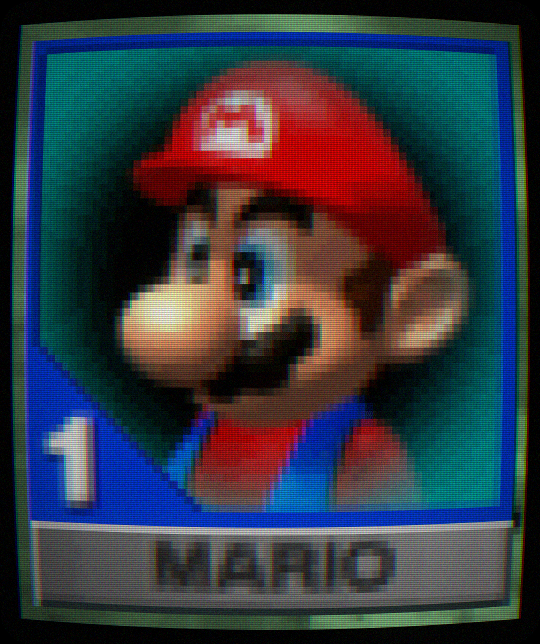
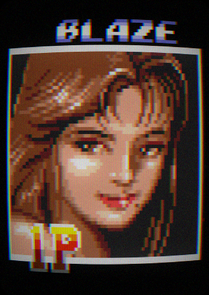

# CRT-filter

This project applies a visual CRT filter on images and videos to make them appear as if they are displayed on an old cathode ray tube television. The program uses the Open Source Computer Vision Library in Python to modify the images.

## Setup the program
```
python3 -m venv .venv # create virtual environment
source .venv/bin/activate # activate virtual environment
pip install -r requirements.txt # install required libraries
```

## Running the program
To run the program, run the `crt_filter.py` file.
For image files:
```
python3 crt_filter.py --input photo.jpg --output photo_crt.png
```
For video files
```
python3 crt_filter.py --input clip.mp4  --output clip_crt.mp4
```
For webcam video
```
python3 crt_filter.py --input 0 --output live_crt.mp4 --seconds 5
```

## Example input and output
Pixel art from the analog era often took advantage of the limitations of CRTs. Unfortunately, this means that on modern flat screen displays, the same pixel art may look pixelated and unsmooth. The following images visualize this:
Original images:\
\
\
Modified images with added parameter, `--barrel 0.05`\
\
\

The first image is a screenshot from Mario Kart 64 (1996), and the second image is a screenshot from Streets of Rage 2 (1992).